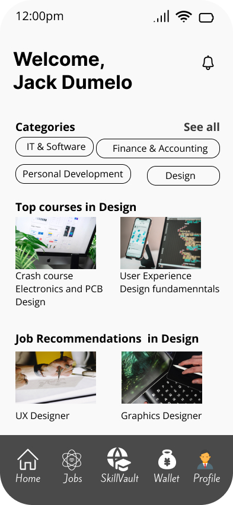

<h1>Hi, I'm Loumie!  <a href="https://github.com/Iamloumie">Potential Software Engineer</a>

<h2>🌱 I’m currently enrolled in Software Engineering programme @ALX</h2>

<h2>👨‍💻 PROJECT:</h2>

- <h3><b>AFRI-CONNECT</b> Mobile Application</h3>

  <h4>About this Project</h4>
  
It is an Artificial intelligence platform that assesses and addresses the problem my team and I  identified in the education and job creation sector in Africa

  <h4>Skills</h4>
  <ul>
    <li><em>Figma</em></li>
    <li><em>UX design</em></li>
    <li><em>Microsoft Excel</em></li>
     <li><em>Problem solving</em></li>
      <li><em>Critical Thinking</em></li>
  </ul>

<h4>Project link</h4>

  
  
<a href="https://drive.google.com/file/d/1UGMnZT_JjPjz6xpXt-OWKRX9PXwq62HR/view?usp=drive_link">
  
  <figcaption>Project documentation.pdf</figcaption>
</a>

- <h3><b>AFRI-CONNECT</b> Pitch video.ALX Presentation</h3>

  <h4>About this Project</h4>
  
A video pitch of the problem identified and the proposed solution

  <h4>Skills</h4>
  <ul>
    <li><em>Good Communication</em></li>
    <li><em>Time Management</em></li>
    <li><em>Good Presentation</em></li>
     <li><em>Audience Engagement</em></li>
  </ul>

<h4>Project link</h4>
  
  
<a href="https://youtu.be/I6EwTVhJ2ro">
  
  <figcaption>Pitch video.mp4</figcaption>
</a>

